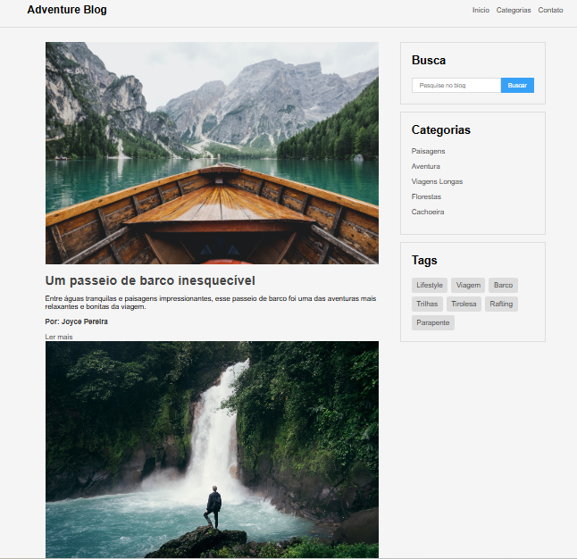

## 🌎 Deploy

👉 [Acesse o projeto aqui](https://joycesantosp03-jpg.github.io/adventure-blog/)

# Adventure Blog

Projeto de blog de viagens e aventuras desenvolvido com HTML5 e CSS3.

## 🚀 Tecnologias utilizadas

- HTML5
- CSS3
- Flexbox
- Responsividade

## 📸 Funcionalidades

- Layout responsivo
- Posts de viagens
- Sidebar com categorias e tags
- Estrutura semântica
- Design moderno

## 👩‍💻 Autora

Joyce Pereira
